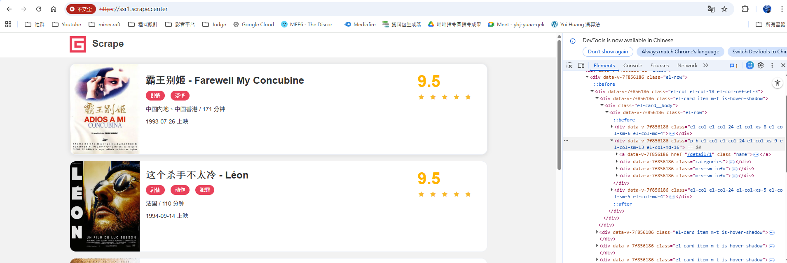
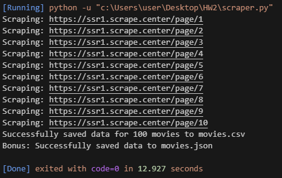
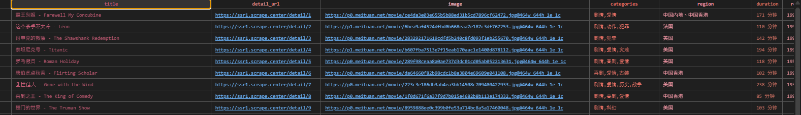
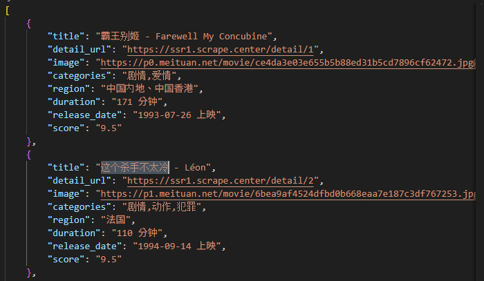

# DIC5 課堂實作：電影網站爬蟲 (Web Scraping Project Report)

## 1. 專案簡介與目標 (Project Overview)
本專案為 DIC5 課堂之爬蟲實作練習。主要目標為撰寫一個 Python 爬蟲程式，從演示網站 `https://ssr1.scrape.center` 中抓取電影公開資訊。
專案規格要求涵蓋 10 個分頁（共 100 筆資料），並針對每部電影精準萃取以下關鍵資訊欄位：電影名稱（`title`）、詳細頁連結（`detail_url`）、海報圖片網址（`image`）、類型（`categories`）、地區（`region`）、片長（`duration`）、上映日期（`release_date`）與評分（`score`）。最終將爬取結果統一清理、整理並輸出為 CSV 與 JSON 檔案格式。

## 2. 使用技術與工具 (Technologies & Tools)
- **程式語言**：Python 3
- **網路請求**：`requests` 套件（負責發送 HTTP 請求並處理例外）
- **網頁解析**：`BeautifulSoup4`（負責解析 HTML 結構並利用 CSS 選擇器萃取目標欄位）
- **資料儲存**：`csv` 及 `json` 標準套件
- **版本控制**：Git 與 GitHub

## 3. 實作過程與技術亮點 (Implementation Details)

### 3.1 網頁結構分析與定位
開發階段首先分析網站的 HTML 結構，透過瀏覽器的開發者工具確認各個目標欄位的對應標籤與 CSS Class：
*   **電影區塊**：定位於 `.el-card.item`，以此為基準迭代單頁上的每一部電影。
*   **資訊擷取欄位**：
    *   標題：`h2.m-b-sm` 
    *   類別：`.categories span`（抓出所有類別後利用 `,` 字元串接）
    *   上映時間：第二個 `.m-v-sm.info`（部分電影無上映時間，實作中已涵蓋防呆邏輯避免程式崩潰）

### 3.2 網路請求防呆與請求間隔控制
為了提升爬蟲的強健性與友善度，針對 `requests.get` 引入了完整的 `try-except` 處理網路連線異常，並加上了 SSL 安全憑證略過設定 (`verify=False`)。同時，在不同分頁爬取之間引入 `time.sleep(1)` 延遲，以避免快速發送高頻請求對目標伺服器造成負擔。

### 3.3 資料清理與導出
將各分頁萃取的結果裝入字典 (Dictionary) 後，最終將陣列整併並透過標準的檔案串流，依序匯出符合題目要求的 UTF-8 (帶 BOM) 的 `movies.csv`。作為進階挑戰，專案中也同樣封裝了 `movies.json` 的產生，方便於後續在不同前端介面及資料庫系統中使用。

## 4. 專案成果展示 (Results & Deliverables)
該爬蟲程式已成功自動化抓取 10 頁，獲得 100 筆完整的電影資料。

### 4.1 核心程式運作紀錄
以下為程式運行於本地終端機時的紀錄，程式可精準追蹤目前的爬取頁數並成功輸出檔案。

### 4.2 CSV 產出結果
輸出的 `movies.csv` 格式排列正確且中文無亂碼。

### 4.3 JSON 產出結果（加分項完成）
輸出的 `movies.json` 以 4 空格縮排並允許非 ASCII 顯示，結構清晰。

## 5. 總結 (Conclusion)
本次實作中，成功組合並善用了 Python 強大的 `requests` 與 `BeautifulSoup` 開發生態，解決了靜態表單解析、多層次 CSS Selector 定位以及邊界狀況（如部分電影缺漏資訊）等開發爬蟲時常見的基礎挑戰，並最終達成了自動化整理與資料格式化的實務演練。
