# AIoT HW2 Report

## 1. 基本資訊

- 作業名稱：HW2 氣溫預報 Web App（使用 CWA API）
- 專案名稱：台灣各分區一週氣象預報系統
- 開發語言：Python
- 主要框架與套件：Streamlit、Requests、Pandas、Plotly、Folium、SQLite3、python-dotenv
- 資料來源：交通部中央氣象署開放資料平台 `F-A0010-001`

## 2. 專案簡介

本專案實作了一個以中央氣象署公開資料為基礎的天氣預報系統。系統會先透過 `weather_crawler.py` 向 CWA API 抓取台灣六大分區的一週氣象預報 JSON，接著分析資料結構，擷取每日的最高溫、最低溫與天氣概況，再將結果存入本地 SQLite 資料庫 `data/data.db`。最後，以 `app.py` 建立 Streamlit Web App，讓使用者可以在網頁上查看各分區的天氣資訊。

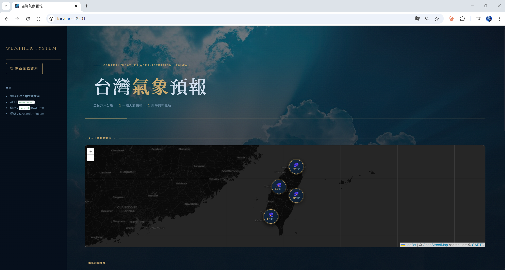

和基本作業要求相比，本專案除了完成資料抓取、清理、存入 SQLite、查詢與視覺化以外，還加入了以下強化項目：

- 以 Folium 製作台灣六大分區地圖，直接在地圖上顯示各分區當日天氣與溫度。
- 以 Plotly 製作互動式折線圖，顯示所選地區一週最高溫與最低溫趨勢。
- 製作自訂風格的首頁 hero、卡片、表格與側欄，讓畫面更完整。
- 在側欄加入「更新氣象資料」按鈕，讓使用者可直接重新抓取最新資料。
- 提供 `start.bat` 與 `.streamlit/config.toml`，方便本機快速啟動與載入靜態背景圖。

## 3. 系統架構與流程

整體流程如下：

1. 使用者在 `.env` 中設定 `CWA_API_TOKEN`。
2. `weather_crawler.py` 使用 Requests 呼叫 CWA API，取得原始 JSON。
3. 程式用 `json.dumps(..., ensure_ascii=False, indent=2)` 輸出原始 JSON 與提取後資料，方便觀察資料結構。
4. 程式從 JSON 中擷取六大分區每天的 `weather`、`MaxT`、`MinT` 與 `dataDate`。
5. 擷取後資料寫入 SQLite3 資料庫 `data/data.db` 的 `TemperatureForecasts` 資料表。
6. `app.py` 從 SQLite 查詢資料，並透過 Streamlit 呈現地圖、卡片、折線圖與詳細表格。
7. 若使用者按下更新按鈕，Web App 會重新執行 `weather_crawler.py` 並清除快取，讓前端立即讀到新資料。

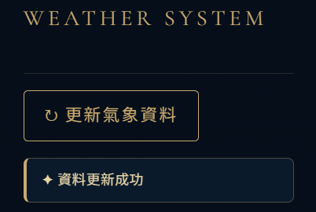

## 4. 各檔案功能說明

### 4.1 `weather_crawler.py`

此檔為資料擷取與資料庫寫入主程式，分成三個主要階段：

- `fetch_weather_data()`
  - 從 `.env` 讀取 `CWA_API_TOKEN`
  - 組合 CWA API URL
  - 以 `requests.get()` 下載 JSON
  - 使用 `response.json()` 解析資料
  - 使用 `json.dumps` 印出前 500 字的原始 JSON，方便觀察巢狀結構

- `extract_temperature_data(data)`
  - 進入 JSON 路徑：
    `cwaopendata -> resources -> resource -> data -> agrWeatherForecasts -> weatherForecasts -> location`
  - 對每個地區抓出：
    - 地區名稱 `regionName`
    - 日期 `dataDate`
    - 天氣描述 `weather`
    - 最高溫 `MaxT`
    - 最低溫 `MinT`
  - 透過 `zip(wx_daily, maxt_daily, mint_daily)` 將同一天資料整合
  - 再使用 `json.dumps` 印出提取後結果，驗證欄位是否正確

- `save_to_sqlite(records, db_file='data/data.db')`
  - 建立或覆蓋 SQLite3 資料庫 `data/data.db`
  - 建立 `TemperatureForecasts` 資料表
  - 將每筆資料寫入資料庫
  - 立即做兩項查詢驗證：
    - `SELECT DISTINCT regionName`
    - 查詢指定地區資料

此外，程式仍保留 `save_to_csv()` 作為輔助輸出，方便除錯與人工檢查，輸出位置為 `data/weather_data.csv`，但目前 Web App 主要資料來源已經改為 SQLite。

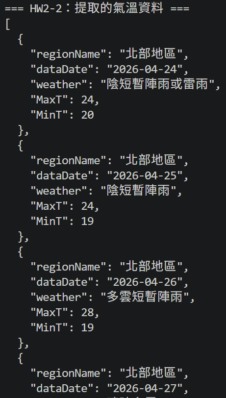
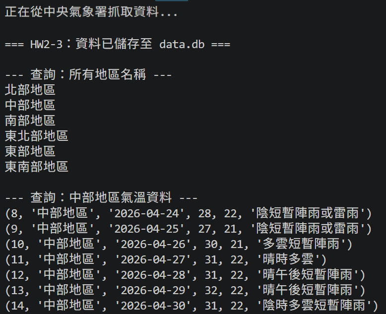

### 4.2 `app.py`

此檔為 Streamlit 主程式，負責前端呈現與資料查詢，主要包含：

- 頁面設定：`st.set_page_config(...)`
- 自訂 CSS：調整背景圖、hero、字體、卡片、表格、側欄與下拉選單樣式
- `load_regions()`：從 SQLite 讀出所有地區
- `load_region_data(region)`：查詢特定地區一週資料
- `load_today_all_regions()`：查詢各地區最早日期那筆資料，做地圖顯示
- 側欄更新按鈕：直接呼叫 `subprocess.run(['python', 'weather_crawler.py'])`
- Folium 地圖：顯示六大分區的天氣 marker 與 popup
- Streamlit 下拉選單：讓使用者選取地區
- Plotly 折線圖：顯示最高溫與最低溫曲線
- 自訂 HTML 表格：呈現詳細每日資料

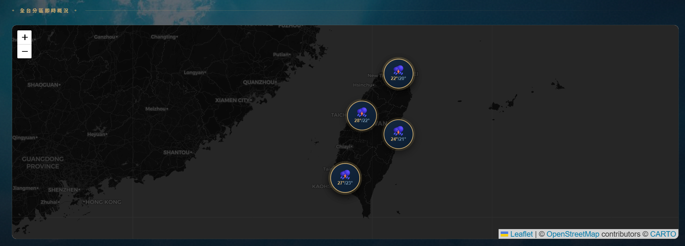
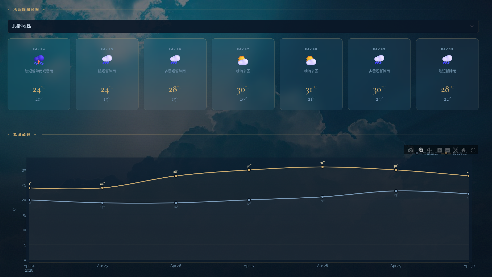
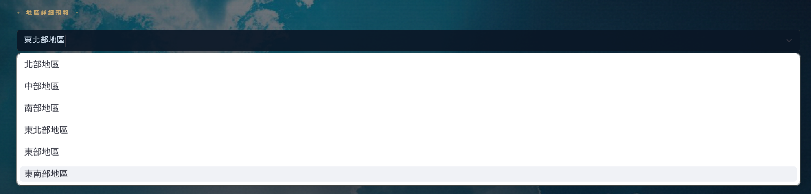
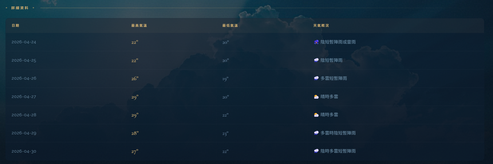

### 4.3 其他檔案

- `start.bat`
  - 提供一鍵啟動 Streamlit 的方式
  - 方便 demo 時直接從專案資料夾開啟

- `.streamlit/config.toml`
  - 啟用靜態檔案服務
  - 讓 `static/clouds.jpg` 可作為背景圖載入

- `.gitignore`
  - 排除 `.env`、`data/data.db`、`data/weather_data.csv` 等執行期或敏感檔案

## 5. 對照 HW2 作業要求

### 5.1 HW2-1 獲取天氣預報資料

已完成項目：

- 使用 CWA API `F-A0010-001` 抓取台灣六大分區一週資料
- 使用 `requests` 套件取得資料
- 回傳格式為 JSON
- 使用 `json.dumps` 印出原始資料前 500 字，觀察資料結構

實作位置：

- `weather_crawler.py -> fetch_weather_data()`

說明：

- 這部分對應作業要求的「使用 Requests 套件調用 CWA API」與「使用 `json.dumps` 觀察獲得資料」。

### 5.2 HW2-2 分析資料並提取最高、最低氣溫

已完成項目：

- 分析 JSON 巢狀資料結構
- 找出 `Wx`、`MaxT`、`MinT` 的每日資料位置
- 擷取每個地區每日的日期、天氣、最高溫與最低溫
- 使用 `json.dumps` 印出提取後資料

實作位置：

- `weather_crawler.py -> extract_temperature_data(data)`

說明：

- 此函式會把原本巢狀 JSON 轉成較平坦的 Python list of dict，方便後續寫入 SQLite 與前端呈現。

### 5.3 HW2-3 將資料存入 SQLite3

已完成項目：

- 建立 SQLite3 資料庫 `data/data.db`
- 建立資料表 `TemperatureForecasts`
- 寫入欄位：
  - `id`
  - `regionName`
  - `dataDate`
  - `MaxT`
  - `MinT`
  - `weather`
- 驗證查詢所有地區名稱
- 驗證查詢特定地區資料

實作位置：

- `weather_crawler.py -> save_to_sqlite(records, db_file='data/data.db')`

目前資料庫驗證結果：

- 總筆數：42 筆
- 地區數：6 個
- 地區名稱：
  - 北部地區
  - 中部地區
  - 南部地區
  - 東北部地區
  - 東部地區
  - 東南部地區

中部地區查詢範例：

```text
中部地區, 2026-04-24, 28, 22, 陰短暫陣雨或雷雨
中部地區, 2026-04-25, 27, 21, 陰短暫陣雨或雷雨
中部地區, 2026-04-26, 30, 21, 多雲短暫陣雨
```
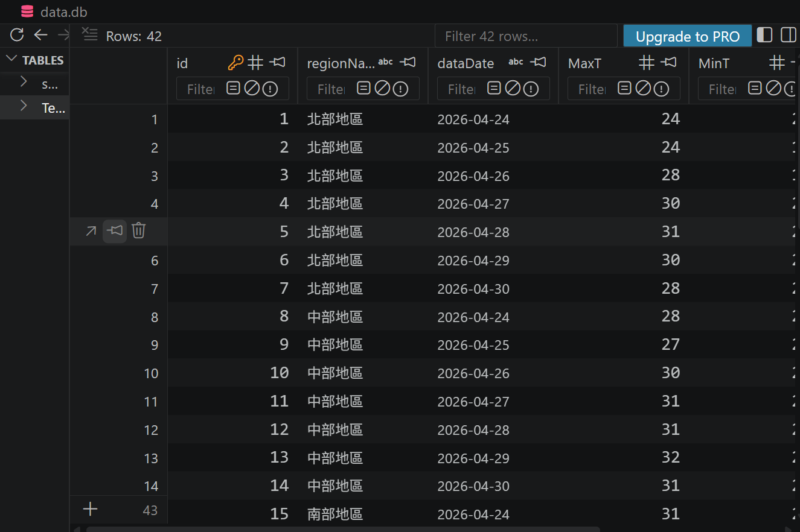

補充：

- 作業範例只要求 `id / regionName / dataDate / MaxT / MinT`，本專案額外保留 `weather` 欄位，讓 Web App 可以顯示天氣描述與圖示。

### 5.4 HW2-4 實作氣溫預報 Web App

已完成項目：

- 使用 Streamlit 建立 Web App
- 提供地區下拉選單
- 從 SQLite3 資料庫查詢資料
- 使用折線圖顯示一週最高與最低氣溫
- 使用表格顯示每日詳細資料

實作位置：

- `app.py`

額外完成的加值功能：

- 台灣六大分區 Folium 地圖
- 天氣卡片式排版
- 重新抓取資料按鈕
- 背景圖與視覺設計
- 響應式字體與更精緻的版面配置

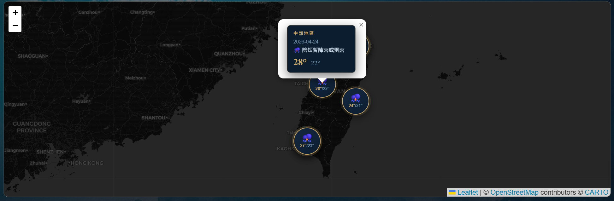
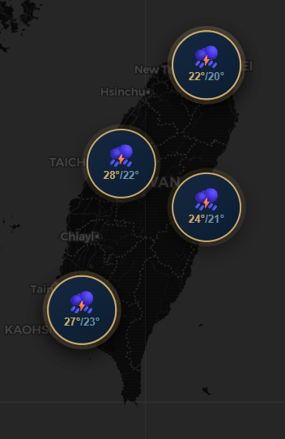

## 6. 專案實作細節

### 6.1 API 與資料處理細節

- API 使用中央氣象署開放資料 `F-A0010-001`
- 使用 `.env` 儲存 API Token，避免把授權碼寫死在程式中
- 透過 `requests.get(..., headers={'User-Agent': 'Mozilla/5.0'})` 下載資料
- 擷取資料時不是直接抓單一欄位，而是分別取出 `Wx`、`MaxT`、`MinT` 的 `daily` 陣列，再一一對應

### 6.2 資料庫設計細節

- 使用 SQLite3，適合課堂作業與單機展示
- 每次更新資料時會重建 `TemperatureForecasts`，確保資料內容和最新 API 回傳一致
- 前端查詢時透過 `pandas.read_sql_query()` 直接讀取成 DataFrame，方便交給 Plotly 與表格使用

### 6.3 前端視覺化細節

- 使用 Streamlit 作為主要 UI 框架
- 使用 Plotly 畫最高溫與最低溫折線圖
- 使用 Folium 製作台灣地圖 marker 與 popup
- 使用自訂 CSS 讓頁面有更完整的設計感
- 透過 `st.cache_data(ttl=600)` 降低重複查詢資料庫的成本

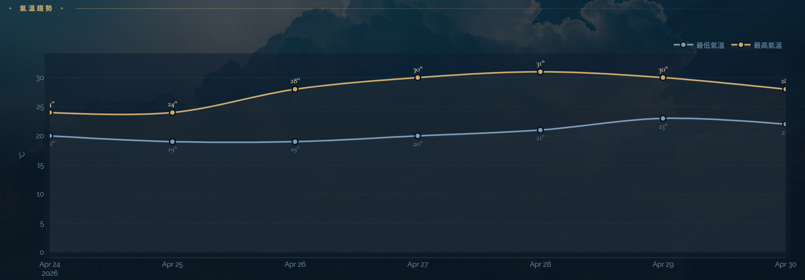

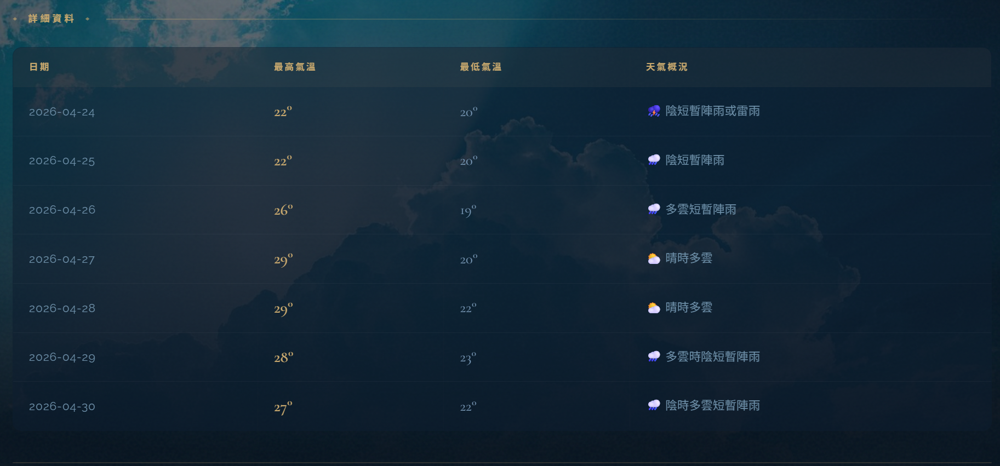

### 6.4 使用者操作流程

1. 啟動 `streamlit run app.py` 或執行 `start.bat`
2. 若尚未有資料，先按左側「更新氣象資料」
3. 系統執行 `weather_crawler.py` 並更新 `data/data.db`
4. 首頁顯示六大分區地圖概況
5. 使用者透過下拉選單選擇特定區域
6. 查看天氣卡片、折線圖與詳細資料表

## 7. 開發過程對話紀錄

本專案在開發過程中有使用 Claude 協助整理需求、分析資料結構與調整介面。以下整理幾段實際開發過程中的代表性對話，作為本專案的 development log。

### 7.1 需求確認階段

在初版完成後，我先要求 AI 幫我對照作業需求檢查缺漏，確認目前版本還缺哪些功能。

我：

> 閱讀 `@HW2_requirement.md` 查看我作業目前還缺甚麼

Claude：

> 目前版本已經能抓取氣象資料並用 Streamlit 顯示，但還有幾個和作業要求不完全符合的地方：  
> 1. `weather_crawler.py` 原本使用的是 `urllib.request`，作業要求指定使用 `requests`。  
> 2. 目前資料主要存成 CSV，但作業要求需要使用 SQLite3，建立 `data.db` 與 `TemperatureForecasts`。  
> 3. Web App 目前讀取 CSV，還需要改成從 SQLite 查詢。  
> 4. 畫面目前主要是卡片呈現，還需要補上折線圖與表格，才能完整符合 HW2-4。

這段對話幫助我明確整理出後續要補強的重點，也確立了「CSV 版本只是過渡，最終仍要回到 SQLite 架構」。

### 7.2 資料結構與功能補強階段

確認缺漏後，我開始針對 JSON 結構、資料欄位與資料庫流程進行修改，將原始 API 資料轉成可存入 SQLite 的格式，並讓前端能夠直接查詢資料庫。

在這個階段，Claude 協助的重點包括：

- 分析 `Wx`、`MaxT`、`MinT` 的每日資料結構
- 整理出 `regionName`、`dataDate`、`weather`、`MaxT`、`MinT` 五個主要欄位
- 建議用 `json.dumps(..., ensure_ascii=False, indent=2)` 檢查原始 JSON 與提取後資料
- 規劃 `save_to_sqlite()` 的資料表建立與查詢驗證流程
- 將前端由讀取 CSV 改成 `pandas.read_sql_query()` 查詢 SQLite

這部分完成後，系統就從單純的資料抓取腳本，進一步變成具備資料儲存、查詢與視覺化能力的小型資訊系統。

### 7.3 介面設計升級階段

在功能完成後，我希望畫面不要只是能用，而是要更完整、更有質感，因此又進一步和 Claude 來回調整設計方向。

我：

> 先把現在紀錄先commit一下，然後想辦法幫我把我的網頁介面改漂亮一點  
> 可以用像下面這個網站背景圖這樣  
> 然後我想要做的有高級感一點，所以字體也要改，做個有質感的氣象預報網頁  
> 但注意不要脫離 `@HW2_requirement.md` 的規定，且台灣地圖顯示分區天氣的功能，還有刷新氣象資料按鈕都要留著

Claude：

> 先保留作業要求的核心功能，再去提升畫面質感。  
> 設計上可以加上背景圖、hero 區塊、較精緻的字體、卡片式天氣資訊與較完整的色彩系統，  
> 但仍然保留台灣分區地圖、更新資料按鈕、下拉選單、折線圖與資料表。

之後我又針對字體細節提出意見：

我：

> 這字體超奇怪 幫我改一下  
> 感覺沒有美感

Claude：

> 目前主標題把英文襯線字體直接套到中文上，所以中文會吃到不一致的 fallback 字體。  
> 接下來把中英文拆開處理，中文改成更穩定的繁中文字體，英文保留精緻感，但只用在適合的地方。

這一輪修改後，最終版介面加入了背景圖、hero 主視覺、較一致的中英文字體系統、重新整理過的卡片、圖表與表格樣式，也讓整體畫面比原本更完整。

### 7.4 開發紀錄整理階段

在完成功能與介面之後，我再要求 AI 協助整理成可提交的書面報告，將作業要求、系統流程、實作細節與完成項目整合成現在這份內容。這也讓整份報告不只是功能清單，而是能清楚說明專案做了什麼、怎麼做、以及如何對應到課堂作業要求。

## 8. 執行方式

### 8.1 安裝套件

```bash
pip install -r requirements.txt
```

### 8.2 設定 `.env`

```env
CWA_API_TOKEN=你的中央氣象署授權碼
```

### 8.3 更新資料

```bash
python weather_crawler.py
```

### 8.4 啟動 Web App

```bash
streamlit run app.py
```

或使用：

```bat
start.bat
```

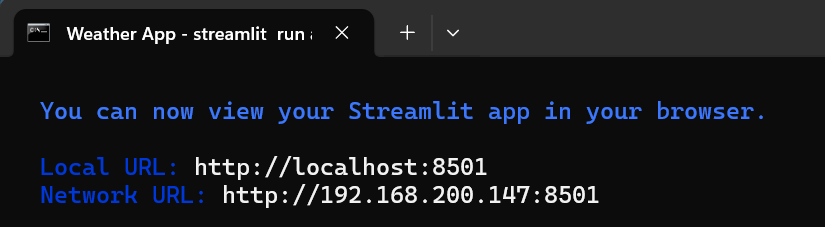

## 9. 完成項目總結

- 完成 CWA API 資料抓取
- 完成 JSON 結構分析與最高/最低氣溫提取
- 完成 SQLite3 儲存與查詢驗證
- 完成 Streamlit Web App
- 完成地區下拉選單
- 完成折線圖與資料表
- 完成 SQLite 查詢串接前端
- 完成台灣地圖分區顯示
- 完成資料更新按鈕
- 完成開發紀錄整理

## 10. 結論

本專案完整實作了 HW2 所要求的四個核心部分：API 抓取、資料分析、SQLite 儲存、Web App 視覺化，並且在基本要求之上進一步完成了地圖、折線圖、卡片式介面、更新按鈕與較完整的前端設計。從實作角度來看，這個專案已經不是單純把資料列出來，而是把資料抓取、資料整理、資料儲存與資料展示串成一個完整的小型資訊系統。
